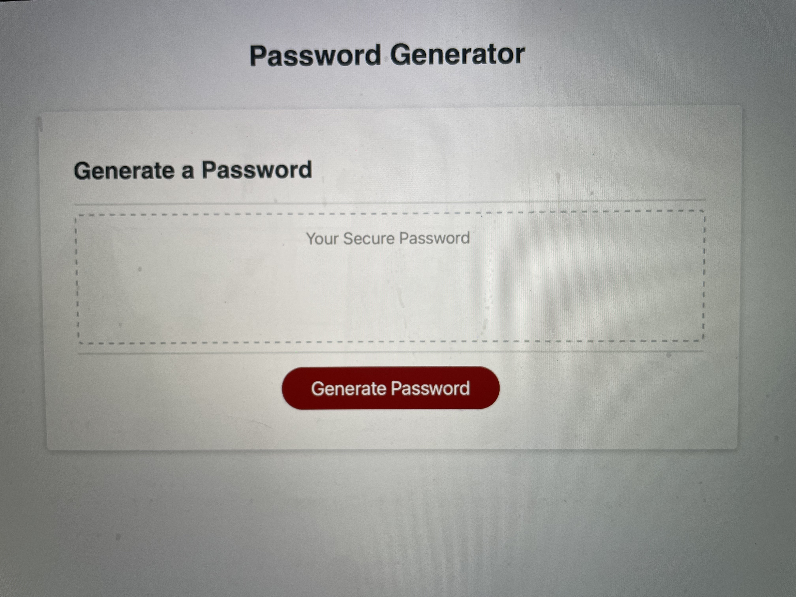

# javascript-random-password-generator

 Author: Alexia Fast

 ## Description

 The assignment was to write the JavaScript for a simple random password generator. In order to accomplish this task I had to make use of basic JavaScript concepts that we learned in class. I made use of variables, loops, functions and “if” statements. I initially found this to be a very difficult assignment as I had never studied JavaScript before, and the logic of it was hard for me to grasp. After working on it for quite some time and having a tutoring session, I could piece together a solution. I found the syntax hard to remember, but I know it will become second nature over time. I especially like seeing the effect of “prompts” and “confirm” as it created an immediate functional result. Overall this was a challenging but rewarding assignment.

 ### View Screenshot below

 

 ### View link to deployed website Below

https://purealexiafast.github.io/javascript-random-password-generator/

 Our licensing is MIT. This ensures that users can re-use the code if desired. They can also make thier own changes or modifications.
